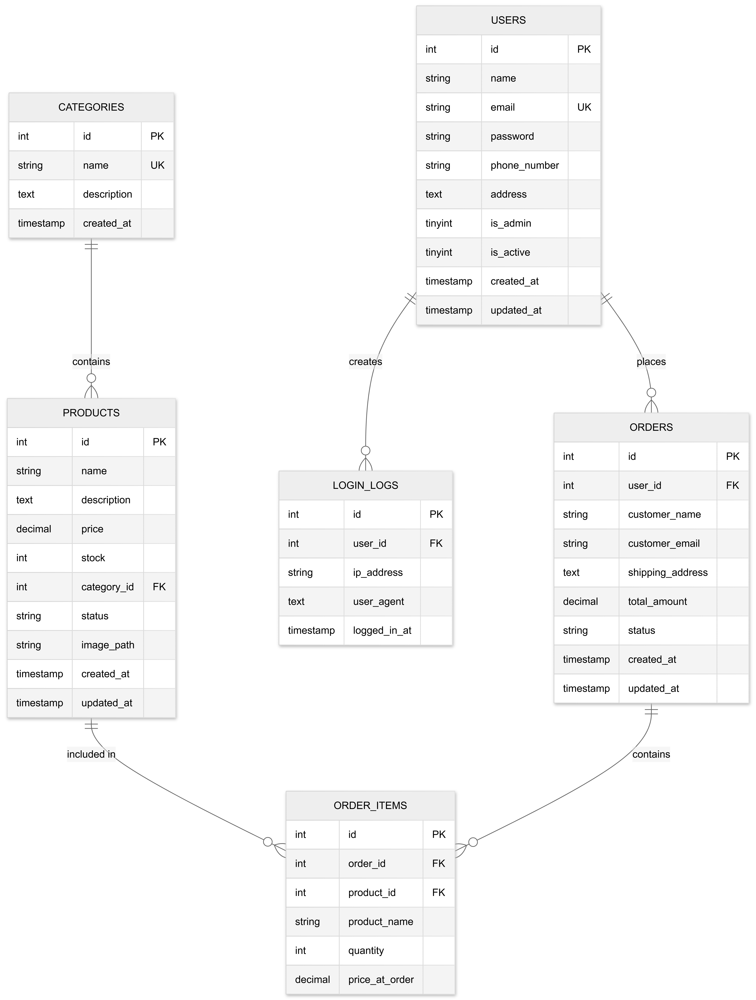

🛒 MTP Flex – Web-Based E-Commerce System

MTP Flex is a web-based e-commerce platform built with PHP and MySQL, designed with a strict separation between customer-facing features and administrator-only functionality.
The system emphasizes clean architecture, security, and scalability, while maintaining a simple and professional user interface.

🚀 Features
👤 User (Customer) Side

Secure user registration and login

Personal My Account dashboard

View and edit profile information

View order history and order status

Shopping cart and checkout flow

User-only navigation (no admin links exposed)

🔒 Admin Side (Private)

Separate admin authentication

Admin-only routes (protected using is_admin = 1)

Manage products, orders, and users

Dedicated admin dashboard

Admin pages are not visible or accessible to normal users

No admin links rendered on user-facing pages

🧱 Technology Stack

Backend: PHP (Core / Procedural PHP)

Database: MySQL

Frontend: HTML, CSS (web-based UI)

Server: Apache (Laragon / XAMPP compatible)

Version Control: Git & GitHub

🔐 Security Design

Role-based access control using is_admin

Admin routes protected by server-side authentication

Admin login URL is not linked anywhere on the user interface

Users cannot access admin pages via navigation or UI

Shared authentication logic with strict authorization checks

🎯 Project Goals

Build a realistic e-commerce system using core PHP

Maintain strict separation between admin and user experiences

Keep database logic clean and reusable

Improve UI/UX without breaking backend logic

Make the system easy to extend in the future

📌 Project Status

✅ User authentication implemented

✅ Admin access protected

✅ User account dashboard functional

✅ Database schema finalized

🔄 UI refinements ongoing

## 🗄️ Database EER Diagram



## ⚙️ Setup & Installation

Follow these steps to run **MTP Flex** locally.

### 1️⃣ Prerequisites
- PHP 8.0 or higher
- MySQL 5.7+ or MariaDB
- Apache Server (Laragon / XAMPP recommended)
- Git (optional, for cloning)

---

### 2️⃣ Clone the Repository
```bash
git clone https://github.com/your-username/MTP-Flex.git
cd MTP-Flex